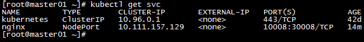

# 十分钟入门 k8s
---
> 近年Docker可谓是火的不能再火了，但是Docker虽然好用，即便是后期出了Docker伴侣Docker-compose，但面对强大的集群，成千上万的容器,运维工程师纵然是千手观音，也管理不了这么多应用，这个时候K8s雪中送炭来了，接替了绝大部分的运维管理工作，解放了双手。
> 本文编写的目的在于帮助那些还没有开始使用 k8s 的 docker 使用者或者即将使用 docker 的同学快速了解并入门 k8s。


## 一、关于 k8s 的基本架构
K8s 全称 kubernets，希腊语意为：舵手，是一种可自动实施 Linux容器操作的开源平台。前期由 Google 的工程师开发和设计，中期由红帽等一系列公司参与合作开发，后期由云原生计算基金会进行更新、迭代。其提供了应用部署、规划、更新、维护的一种机制，可以省去应用容器化过程的许多手动部署和扩展操作，将运行 Linux 容器的多组主机聚集在一起，轻松高效地管理集群。

要学习使用K8s，首先要了解K8s的架构、组件以及特点，说到集群，我们不免会想到master、slaver 或者 node，k8s集群也是这样，由多台 master 和 node 组成，由 master 控制 node，由node（也可以是master）提供服务，如图一所示：


**什么是 master：**
master 的组件包括 apiserver、controller-manager、scheduler 和 etcd，那么这几个组件是用来做什么的呢？我做了个简单的比喻： 
图
* **Apiserver（房子入口）：**K8S对外的唯一接口，提供HTTP/HTTPS RESTful API，即所有的请求都需要经过这个接口进行通信
* **Etcd （后勤人员）：** 负责保存k8s 集群的配置信息和各种资源的状态信息，当数据发生变化时，etcd会快速地通知k8s相关组件 
* **Controller Manager （管理者）：**负责管理集群各种资源，保证资源处于预期的状态
* ** Schedule （负责调度）：** 资源调度，负责决定将 Pod 放到哪个 Node 上运行
 
**什么是 node:**
那么 Node 又是什么呢？说透了 Node 就是干活的。Node的组件包括 Kubelet、Container Runtime、Kube-proxy。

* **Kubelet（来料加工生产）：**kubelet 是 node 的 agent，kubelet 会根据 pod 信息创建和运行容器，并向master报告运行状态
* **Container Runtime （下载运行）：**每个Node都需要提供一个容器运行（Container Runtime）环境，它负责下载镜像并运行容器。

* **Kube-proxy（传输纽带）：** 用户通过service（即将介绍）访问Pod，每个Node都会运行kube-proxy服务，将访问的service的TCP/UDP数据流转发到后端的容器

如此，我们也形象地了解了 node 和 node 组件的作用，与此同时，文中提到了 pod 和 service，那么这两个英文单词在K8S中表示什么呢？
**Pod 资源对象**是一种集合了一个或多个应用容器、存储资源、专用ip、以及支撑运行的其他选项的逻辑组件，用大白话讲，pod好比一场舞台剧，是导演、编剧编排好以后由演员、灯光、道具、场务等协作完成的一场戏。
**Service资源**就是在被访问的Pod对象中添加一个有着固定IP地址的中间层，Service资源将客户访问进行调度并代理到后端的Pod对象，Service 起到了通道的作用。Service就好比是个向导，负责将客户带到pod这场舞台剧来观看。

## 二、快速开始 k8s
**1.准备：**
*  首先我们启动 6 个docker容器，3个master以及3个node。
* 所有机器关闭swap、关闭防火墙和SELinux
* 三台 master 安装好 keepalived 和haproxy，并做好相应配置（例如虚拟 ip 为172.153.100.100）

**2.安装k8s：**
* 以 Centos 为例，
2.1 替换 k8s 安装源
```sh
sudo cat <<EOF > /etc/yum.repos.d/kubernetes.repo
[kubernetes]
name=Kubernetes
baseurl=https://mirrors.aliyun.com/kubernetes/yum/repos/kubernetes-el7-x86_64/
enabled=1
gpgcheck=1
repo_gpgcheck=1
gpgkey=https://mirrors.aliyun.com/kubernetes/yum/doc/yum-key.gpg https://mirrors.aliyun.com/kubernetes/yum/doc/rpm-package-key.gpg
EOF
```
2.2 修改权限
```sh
sudo chown root:root /etc/yum.repos.d/kubernetes.repo
```
2.3 更新 yum 源
```sh
sudo yum update -y
```

**3.使用**
我们以用 k8s 管理 nginx 服务器为例：

首先在三台maste主机上相应目录**创建以下两个文件**
```sh
touch  nginx-pod.yaml nginx-svc.yaml
```
nginx-pod.yaml、nginx-svc.yaml 具体内容参看 repo 代码，公众号用户点击查看原文。

**启动服务：** 在配置文件路径下启动nginx请按照如下命令依次执行： 
```sh
Kubevt create -f ngixn-pod.yaml
Kubevt create -f ngixn-svc.yaml

```
等待1分钟左右，执行 `kubectl get pods `,显示 nginx 启动状态为running,说明pod已经启动成功，


执行 `kubectl get svc --all-namcpaces` 或者 service，可以得到端口映射状态。



此时访问每台 node 的 30008 端口都会访问到 nginx 的 web 初始界面，这说明集群启动成功，运行其他应用也如此，前提是 pod 和 svc 配置文件要配的正确，后期会深入学习如何配置 namespace 和 Deployment 文件。

**关闭服务：** 按顺序依次执行

```sh
Kubevt delete -f ngixn-svc.yaml
Kubevt delete -f ngixn-pod.yaml
```

**安装 dashboard** 完成集群可视化

## 三、总结

以上8点即K8s集群的简单部署。本集群的工作原理是，所有的节点均可以通过haproxy对外提供服务，所有的服务由一个master控制，当主master宕机或者出现服务异常的时候，会通过keepalived将控制权转移到下一个权重的mster,其他的节点不至于出现群龙无首的局面。初始化mster过程为部署重点，初始过程有可能加载需要时间或者超时，需要重点关注。同时要注意的是，官方的指导文档是将etcd独立安装，比较繁琐，本文把etcd封装于镜像之中，目前阿里云提供的K8s，也是将Etcd当做组件做成了镜像，您部署的时候也可以采用官方的教程，部署方法各有千秋，稳定、方便是首选。


