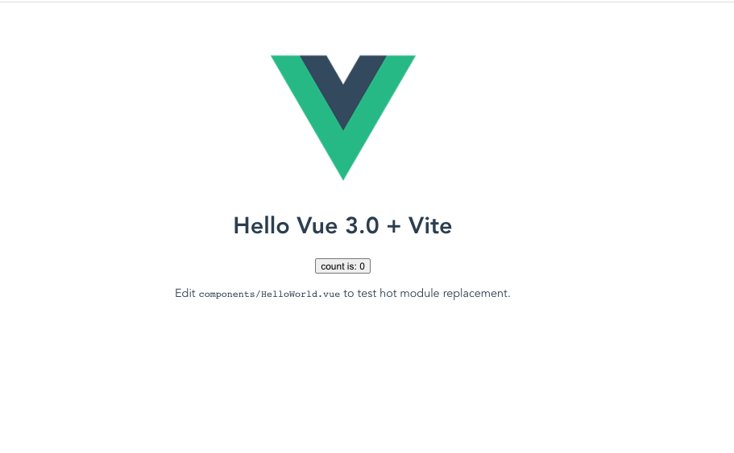
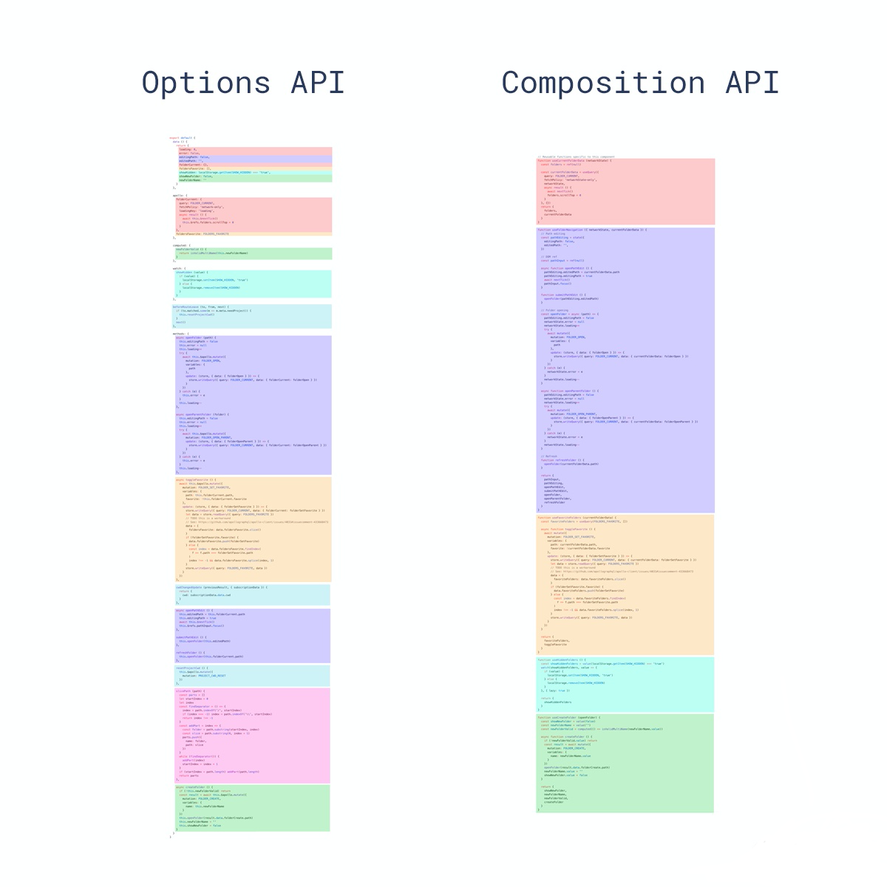
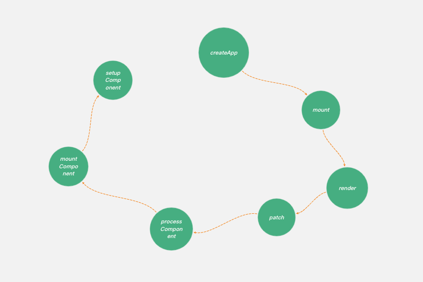

# VUE3.0有哪些改变，以及新特性 Composition API 的实现原理

# 前言

距离2020 年 9 月 18 日发布vue3.0正式版本已经3个多月了，作为技术人员，随时保持技术同步是很重要的事情。本文就让作者来带领大家看一看3.0对比2.x到底有哪些改变。


# 一、建立项目
vue3.0 有两种建立脚手架的方式
脚手架 Vite
```
npm init vite-app hello-vue3 # OR yarn create vite-app hello-vue3
```
脚手架 vue-cli
```
npm install -g @vue/cli # OR yarn global add @vue/cli
vue create hello-vue3
# select vue 3 preset
```

作者是使用yarn create vite-app hello-vue3建立脚手架。
使用yarn 命令安装依赖后，输入yarn dev 就可以运行起项目。

项目显示如下图所示




# 二、非兼容的变更
## 1.v-model新语法糖

在 2.x 中，在组件上使用 v-model 相当于绑定 value prop 和 input 事件
```javascript
<ChildComponent v-model="pageTitle" />

<!-- 简写: -->

<ChildComponent :value="pageTitle" @input="pageTitle = $event" />
```

在 3.x 中，自定义组件上的 v-model 相当于传递了 modelValue prop 并接收抛出的 update:modelValue 事件
```javascript
<ChildComponent v-model="pageTitle" />

<!-- 简写: -->

<ChildComponent
  :modelValue="pageTitle"
  @update:modelValue="pageTitle = $event"
/>
```
允许我们在自定义组件上使用多个 v-model
```javascript
<ChildComponent v-model:title="pageTitle" v-model:content="pageContent" />

<!-- 简写： -->

<ChildComponent
  :title="pageTitle"
  @update:title="pageTitle = $event"
  :content="pageContent"
  @update:content="pageContent = $event"
/>
```
## 2.一个新的全局 API：createApp
Vue 2.x 有许多全局 API 和配置，例如，要创建全局组件，可以使用 Vue.component 这样的 API
```javascript
Vue.component('button-counter', {
  data: () => ({
    count: 0
  }),
  template: '<button @click="count++">Clicked {{ count }} times.</button>'
})
```
全局指令使用 Vue.directive声明
```javascript
Vue.directive('focus', {
  inserted: el => el.focus()
})
```
但是全局配置很容易意外地污染其他测试用例，需要自己去除一些副作用

Vue 3 中我们引入createApp，调用 createApp 返回一个应用实例

```javascript
import { createApp } from 'vue'
import App from './App.vue'

const app = createApp(App).mount('#app')
```

以下是当前全局 API 及其相应实例 API 的表：
|  2.x 全局 API|  3.x 实例 API (app)|
|--|--|
|  Vue.config| app.config |
| Vue.config.ignoredElements| app.config.isCustomElement |
|  Vue.component| app.component |
|  Vue.directive| app.directive |
|  Vue.mixin| app.mixin |
|  Vue.use| 	app.use  |


## 3. 全局 API Treeshaking

在 Vue 3 中，重构了全局和内部 API ，并考虑了 tree-shaking 的支持。因此，全局 API 现在只能作为 ES 模块构建的命名导出进行访问。没有用到的代码最后不会被打到最终的包中。这可以优化项目体积。当然用法也需要进行相应的改变：
```javascript
import { nextTick } from 'vue'

nextTick(() => {
  // 一些和DOM有关的东西
})
```
不能再使用Vue.nextTick/this.$nextTick,调用将会导致 undefined is not a function 错误。

## 4. 其他的改变
VUE3.0还有一些其他的改变，例如

 - Render 函数参数  <font color=#999AAA >h 现在是全局导入的，而不是作为参数自动传递</font>
 - 在同一元素上使用的 v-if 和 v-for 优先级已更改 <font color=#999AAA > v-if 总是优先于 v-for 生效</font>
 - v-bind 合并行为  <font color=#999AAA >如果一个元素同时定义了 v-bind="object" 和一个相同的单独的 property,合并最后定义的属性</font>
	 ```javascript
	  <!-- template -->
  	<div id="red" v-bind="{ id: 'blue' }"></div>
  	<!-- result -->
  	<div id="blue"></div>
  	
  	<!-- template -->
  	<div v-bind="{ id: 'blue' }" id="red"></div>
  	<!-- result -->
  	<div id="red"></div>
	 ```
 - 过滤器已删除，不再支持
 - \$on，\$off 和 \$once 实例方法已被移除
 - 不再支持使用数字 (即键码) 作为 v-on 修饰符、不再支持 config.keyCodes
 - ...
 更多变化内容可以查看vue3文档： [Vue3文档 ](https://www.vue3js.cn/docs/zh/guide/installation.html)

# 三、新特性 Composition API

   * 在 Vue.js 1.x 和 2.x 版本中，编写组件本质就是在编写一个“包含了描述组件选项的对象”，我们把它称为 Options API
   * Options API 的设计是按照 methods、computed、data、props 这些不同的选项分类，当组件小的时候，这种分类方式一目了然；但是在大型组件中，一个组件可能有多个逻辑关注点，当使用 Options API 的时候，每一个关注点都有自己的 Options，如果需要修改一个逻辑点关注点，就需要在单个文件中不断上下切换和寻找。
   * Vue.js 3.0 提供了一种新的 API：Composition API，它提供了一个 setup 启动函数作为逻辑组织的入口，暴露了响应式 API 为用户所用，也提供了生命周期函数以及依赖注入的接口，就是将某个逻辑关注点相关的代码全都放在一个函数里，这样当需要修改一个功能时，就不再需要在文件中跳来跳去。

<font color=#999AAA >Composition API 属于 API 的增强，它并不是 Vue.js 3.0 组件开发的范式，如果你的组件足够简单，你还是可以使用 Options API。</font>

通过以下代码了解一下Composition API
```javascript
<template>
  <button @click="increment">
    Count is: {{ state.count }}, double is: {{ state.double }}
  </button>
</template>
<script>
import { reactive, computed } from 'vue'
export default {
  setup() {
    const state = reactive({
      count: 0,
      double: computed(() => state.count * 2)
    })
    function increment() {
      state.count++
    }
    return {
      state,
      increment
    }
  }
}
</script>
```
可以看到，这段代码和 Vue.js 2.x 组件的写法相比，多了一个 setup 启动函数，另外组件中也没有定义 props、data、computed 这些 options。

在 setup 函数内部，定义了一个响应式对象 state，它是通过 reactive API 创建的。state 对象有 count 和 double 两个属性，其中 count 对应一个数字属性的值；而double 通过 computed API 创建，对应一个计算属性的值。

# 四、Composition API 的实现原理
下图是VUE3源码中执行到setupComponent方法的执行链路



setup 启动函数的主要逻辑是在渲染 vnode 的过程中
```javascript
  const mountComponent: MountComponentFn = (
    initialVNode,
    container,
    anchor,
    parentComponent,
    parentSuspense,
    isSVG,
    optimized
  ) => {
    // 创建组件实例
    const instance: ComponentInternalInstance = (initialVNode.component = createComponentInstance(
      initialVNode,
      parentComponent,
      parentSuspense
    ))

  // 设置组件实例
  setupComponent(instance)
    // 设置并运行渲染函数
    setupRenderEffect(
      instance,
      initialVNode,
      container,
      anchor,
      parentSuspense,
      isSVG,
      optimized
    )
  }
```
创建组件实例的流程，我们要关注 createComponentInstance 方法的实现
```javascript
export function createComponentInstance(
  vnode: VNode,
  parent: ComponentInternalInstance | null,
  suspense: SuspenseBoundary | null
) {
  const type = vnode.type as ConcreteComponent
  // 继承父组件实例上的 appContext，如果是根组件，则直接从根 vnode 中取。
  const appContext =
    (parent ? parent.appContext : vnode.appContext) || emptyAppContext

  const instance: ComponentInternalInstance = {
	// 组件唯一 id
    uid: uid++,
    // 组件 vnode
    vnode,
    // 父组件实例
    parent,
    // app 上下文
    appContext,
    // vnode 节点类型
    type: vnode.type,
    // 根组件实例
    root: null,
    // 新的组件 vnode
    next: null,
    // 子节点 vnode
    subTree: null,
    // 带副作用更新函数
    update: null,
    // 渲染函数
    render: null,
    // 渲染上下文代理
    proxy: null,
    // 带有 with 区块的渲染上下文代理
    withProxy: null,
    // 响应式相关对象
    effects: null,
    // 依赖注入相关
    provides: parent ? parent.provides : Object.create(appContext.provides),
    // 渲染代理的属性访问缓存
    accessCache: null,
    // 渲染缓存
    renderCache: [],
    // 渲染上下文
    ctx: EMPTY_OBJ,
    // data 数据
    data: EMPTY_OBJ,
    // props 数据
    props: EMPTY_OBJ,
    // 普通属性
    attrs: EMPTY_OBJ,
    // 插槽相关
    slots: EMPTY_OBJ,
    // 组件或者 DOM 的 ref 引用
    refs: EMPTY_OBJ,
    // setup 函数返回的响应式结果
    setupState: EMPTY_OBJ,
    // setup 函数上下文数据
    setupContext: null,
    // 注册的组件
    components: Object.create(appContext.components),
    // 注册的指令
    directives: Object.create(appContext.directives),
    // suspense 相关
    suspense,
    // suspense 异步依赖
    asyncDep: null,
    // suspense 异步依赖是否都已处理
    asyncResolved: false,
    // 是否挂载
    isMounted: false,
    // 是否卸载
    isUnmounted: false,
    // 是否激活
    isDeactivated: false,
    // 生命周期，before create
    bc: null,
    // 生命周期，created
    c: null,
    // 生命周期，before mount
    bm: null,
    // 生命周期，mounted
    m: null,
    // 生命周期，before update
    bu: null,
    // 生命周期，updated
    u: null,
    // 生命周期，unmounted
    um: null,
    // 生命周期，before unmount
    bum: null,
    // 生命周期, deactivated
    da: null,
    // 生命周期 activated
    a: null,
    // 生命周期 render triggered
    rtg: null,
    // 生命周期 render tracked
    rtc: null,
    // 生命周期 error captured
    ec: null,
    // 派发事件方法
    emit: null  
   }
   // 初始化渲染上下文
  instance.ctx = { _: instance }
  // 初始化根组件指针
  instance.root = parent ? parent.root : instance
  // 初始化派发事件方法
  instance.emit = emit.bind(null, instance)
  return instance
}
```

组件实例的设置流程
```javascript
export function setupComponent(
  instance: ComponentInternalInstance,
  isSSR = false
) {
  const { props, children, shapeFlag } = instance.vnode
  // 判断是否是一个有状态的组件
  const isStateful = shapeFlag & ShapeFlags.STATEFUL_COMPONENT
  // 初始化 props
  initProps(instance, props, isStateful, isSSR)
  // 初始化 插槽
  initSlots(instance, children)
  // 设置有状态的组件实例
  const setupResult = isStateful
    ? setupStatefulComponent(instance, isSSR)
    : undefined
  isInSSRComponentSetup = false
  return setupResult
}
```
接下来是setup函数判断处理和完成组件实例设置
```js
function setupStatefulComponent(
  instance: ComponentInternalInstance,
  isSSR: boolean
) {
  const Component = instance.type as ComponentOptions

  // 0. 创建渲染代理的属性访问缓存
  instance.accessCache = Object.create(null)
  // 1. 创建渲染上下文代理
  instance.proxy = new Proxy(instance.ctx, PublicInstanceProxyHandlers)
  // 2. 判断处理 setup 函数
  const { setup } = Component
  if (setup) {
  	//如果 setup 函数带参数，则创建一个 setupContext
    const setupContext = (instance.setupContext =
      setup.length > 1 ? createSetupContext(instance) : null)

    currentInstance = instance
    pauseTracking()
    // 执行 setup 函数，获取结果
    const setupResult = callWithErrorHandling(
      setup,
      instance
    )
	// 处理 setup 执行结果
    if (isPromise(setupResult)) {
      instance.asyncDep = setupResult
    } else {
      handleSetupResult(instance, setupResult, isSSR)
    }
  }
}
```
接下来我们需要了解创建渲染上下文代理函数PublicInstanceProxyHandlers，我们访问 instance.ctx 渲染上下文中的属性时，就会进入 get 函数,当我们修改 instance.ctx 渲染上下文中的属性的时候，就会进入 set 函数。
```js
export const PublicInstanceProxyHandlers: ProxyHandler<any> = {
  get({ _: instance }: ComponentRenderContext, key: string) {
    const {
      ctx,
      setupState,
      data,
      props,
      accessCache,
      type,
      appContext
    } = instance

    let normalizedProps
    if (key[0] !== '$') {
      // setupState / data / props / ctx
      // 渲染代理的属性访问缓存中
      const n = accessCache![key]
      if (n !== undefined) {
      	// 如果缓存有内容，则从缓存里取数据
        switch (n) {
          case AccessTypes.SETUP:
            return setupState[key]
          case AccessTypes.DATA:
            return data[key]
          case AccessTypes.CONTEXT:
            return ctx[key]
          case AccessTypes.PROPS:
            return props![key]
        }
      } else if (setupState !== EMPTY_OBJ && hasOwn(setupState, key)) {
      	// 从 setupState 中取数据
        accessCache![key] = AccessTypes.SETUP
        return setupState[key]
      } else if (data !== EMPTY_OBJ && hasOwn(data, key)) {
      	// 从 data 中取数据
        accessCache![key] = AccessTypes.DATA
        return data[key]
      } else if (
        (normalizedProps = instance.propsOptions[0]) &&
        hasOwn(normalizedProps, key)
      ) {
      	// 从 props 中取数据
        accessCache![key] = AccessTypes.PROPS
        return props![key]
      } else if (ctx !== EMPTY_OBJ && hasOwn(ctx, key)) {
      	//  从 ctx 中取数据
        accessCache![key] = AccessTypes.CONTEXT
        return ctx[key]
      } else if (!__FEATURE_OPTIONS_API__ || !isInBeforeCreate) {
        accessCache![key] = AccessTypes.OTHER
      }
    }

    const publicGetter = publicPropertiesMap[key]
    let cssModule, globalProperties
    // 公开的 $xxx 属性或方法
    if (publicGetter) {
      return publicGetter(instance)
    } else if (
      // css 模块，通过 vue-loader 编译的时候注入
      (cssModule = type.__cssModules) &&
      (cssModule = cssModule[key])
    ) {
      return cssModule
    } else if (ctx !== EMPTY_OBJ && hasOwn(ctx, key)) {
      // 用户自定义的属性，也用 `$` 开头
      accessCache![key] = AccessTypes.CONTEXT
      return ctx[key]
    } else if (
      // 全局定义的属性
      ((globalProperties = appContext.config.globalProperties),
      hasOwn(globalProperties, key))
    ) {
      return globalProperties[key]
    } else if (
      __DEV__ &&
      currentRenderingInstance &&
      (!isString(key) ||
        // #1091 avoid internal isRef/isVNode checks on component instance leading
        // to infinite warning loop
        key.indexOf('__v') !== 0)
    ) {
      if (
        data !== EMPTY_OBJ &&
        (key[0] === '$' || key[0] === '_') &&
        hasOwn(data, key)
      ) {
      	// 如果在 data 中定义的数据以 $ 开头，会报警告，因为 $ 是保留字符，不会做代理
        warn(
          `Property ${JSON.stringify(
            key
          )} must be accessed via $data because it starts with a reserved ` +
            `character ("$" or "_") and is not proxied on the render context.`
        )
      } else {
      	// 在模板中使用的变量如果没有定义，报警告
        warn(
          `Property ${JSON.stringify(key)} was accessed during render ` +
            `but is not defined on instance.`
        )
      }
    }
  },

  set(
    { _: instance }: ComponentRenderContext,
    key: string,
    value: any
  ): boolean {
    const { data, setupState, ctx } = instance
    if (setupState !== EMPTY_OBJ && hasOwn(setupState, key)) {
      // 给 setupState 赋值
      setupState[key] = value
    } else if (data !== EMPTY_OBJ && hasOwn(data, key)) {
      // 给 data 赋值
      data[key] = value
    } else if (key in instance.props) {
      // 不能直接给 props 赋值
      return false
    }
    if (key[0] === '$' && key.slice(1) in instance) {
      // 不能给 Vue 内部以 $ 开头的保留属性赋值
      return false
    } else {
      // 用户自定义数据赋值
      ctx[key] = value
    }
    return true
  }
}
```
这里要注意顺序问题，优先判断 setupState，然后是 data，接着是 props。</br>
通过源码我们分析了组件的初始化流程，包括了创建组件实例和设置组件实例。通过进一步深入细节，我们也了解了渲染上下文的代理过程。了解了 Composition API 中的 setup 启动函数执行的时机，以及如何建立 setup 返回结果和模板渲染之间的联系。


# 总结
本文从搭建VUE3项目开始入手，列出了VUE3和VUE2.X的非兼容的变更，演示了VUE3的新特性Composition API，相对于Options API的一些优点，最后我们对Composition API怎么实现，通过源码给大家解析实现原理。希望大家通过本文可以对VUE3有一定初步的了解并有所收获。</br>
本人文笔水平有限，若有错误或不足，还望指正，谢谢大家。


