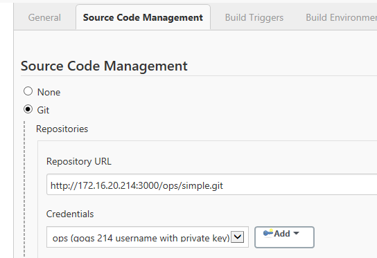
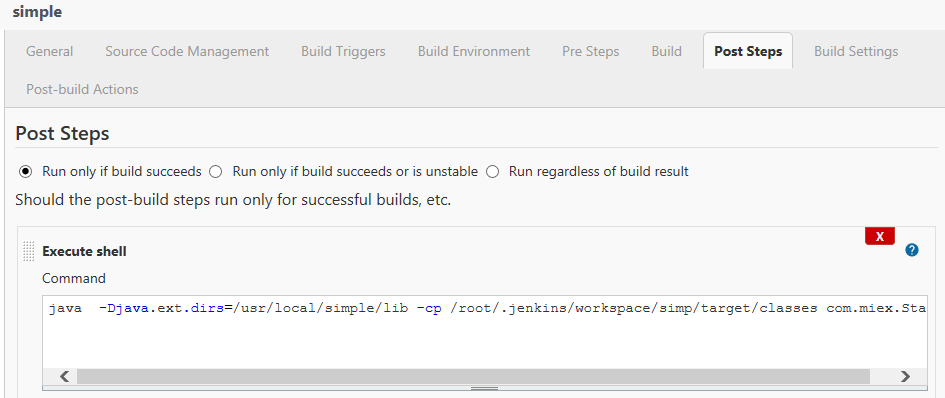

<h1>Jenkins 持续集成环境的部署及基本使用</h1>
<h2>一、jenkins 基本概念</h2>
&nbsp; &nbsp; &nbsp; &nbsp; 在传统项目开发过程中，版本迭代是周期性的，每周或每月进行一次版本迭代，对运维人员的压力也较小。如今很多项目都是持续集成的，便于问题的暴露与及时解决，每天都可能进行若干次发布操作，这将使运维人员的压力激增。聪明的运维人员会写自动化脚本替代手工操作，而更聪明的会选择 <b>jenkins</b>，一个强大的持续集成工具，可用于代码的自动化构建、测试与部署。  

持续集成要点：
- 统一的代码库(git)
- 测试自动化
- 构建全自动化(maven)
- 部署自动化
- 可追踪的集成记录
- <b>. . .</b>

jenkens可以轻松的将这些要点统一管理、使用。


<h2>二、工具安装</h2>
<h3><b>2.1 GIT</b></h3>

<b>安装</b>

- apt-get

```sh
apt-get install git
```

- yum
```sh
yum install git
```

- zypper

```sh
zypper install git
```
<p><b>验证</b></p>
能正确显示版本信息则成功安装

```sh
git --version
```

<p><b>创建公私钥</b></p>
创建公私钥用于ssh方式的免密登录

```sh
ssh-keygen -t rsa -C "your_email@example.com"
```
大致步骤应该显示如下,将在 <u>~/.ssh/</u> 目录下生成私钥 <b>id_ras</b> 与公钥 <b>id_ras.pub</b>

---

Generating public/private rsa key pair.  
Enter file in which to save the key (/root/.ssh/id_rsa):[回车]  
Created directory '/root/.ssh'.  
Enter passphrase (empty for no passphrase): [回车]  
Enter same passphrase again: [回车]  

---

将私钥保存在本地

```sh
eval "$(ssh-agent -s)"  
ssh-add ~/.ssh/id_rsa
```
复制公钥内容，保存在git服务器上(不同的git服务器位置不同)


<p></p>

<h3><b>2.2 maven</b></h3>
安装

```sh
wget https://mirrors.tuna.tsinghua.edu.cn/apache/maven/maven-3/3.6.3/binaries/apache-maven-3.6.3-bin.tar.gz
tar -zxvf apache-maven-3.6.3-bin.tar.gz -C /usr/local/
echo 'export MAVEN_HOME=/usr/local/apache-maven-3.6.3' >> /etc/profile
echo 'export PATH=${PATH}:${MAVEN_HOME}/bin' >> /etc/profile
source /etc/profile
```
验证(显示Maven home与Java version为正常)
```sh
mvn -v
```

<h3><b>2.3 jenkins安装与基本配置</b></h3>

+ 获取war包

```
wget http://mirrors.jenkins-ci.org/war/2.263/jenkins.war
```
以软件包形式安装见官网(https://www.jenkins.io/doc/book/installing/linux/)

+ 基本配置（软件形式安装才有配置文件/etc/sysconfig/jenkons）

<table border=1 >
    <tr>
        <td>命令行</td> <td>配置文件</td> <td>说明</td>
    </tr>
    <tr>
        <td>--httpPort=8080</td> <td>JENKINS_PORT="8080"</td> <td>http端口(默认8080,禁用-1)</td>
    </tr>
    <tr>
        <td>--httpListenAddress=0.0.0.0</td> <td>JENKINS_LISTEN_ADDRESS=""</td> <td>绑定访问地址，默认0.0.0.0</td>
    </tr>
    <tr>
        <td>--httpsPort=$HTTPS_PORT</td> <td>JENKINS_HTTPS_PORT=""</td> <td>https端口，默认禁用</td>
    </tr>
    <tr>
        <td>--prefix=$PREFIX</td> <td></td> <td>主页路径，host:port/$PREFIX</td>
    </tr>
    <tr>
        <td></td> <td>JENKINS_USER="jenkins"</td> <td>jenkins用户</td>
    </tr>
    <tr>
        <td></td> <td>JENKINS_HOME="/var/lib/jenkins"</td> <td>存储配置及工作文件的目录</td>
    </tr>

</table>

+ 首次运行及访问

```sh
java -jar jenkins.war --httpPort=8080
```
首次运行会生成密码用于登录验证，密码保存于：$HOME/.jenkins/secrets/initialAdminPassword


访问http://$host:8080 即可使用 jenkins。<br/>


<h2>三、jenkins中配置git与maven</h2>
<h3><b>3.1 确保git及maven插件已经安装</b></h3>
已安装的插件：http://$host:8080/pluginManager/installed</br>


</br>可安装的插件：http://$host:8080/pluginManager/available ，或点击Available并搜索插件

<h3><b>3.2 配置git</b></h3>
配置地址为：http://$host:8080/credentials/store/system/domain/_/newCredentials

+ 使用 用户名/密码 的方式


+ 使用 用户名/密钥 的方式


<h3><b>3.3 配置maven</b></h3>
配置地址为：http://$host:8080/configureTools/</br>


</br>取消Install automatically的勾选，MAVEN_HOME的地址可通过 <span style="color:#6A5ACD">echo ${MAVEN_HOME}</span> 查看

<h2>四、创建一个简单的maven job</h2>
创建job的地址为：http://$host:8080/view/all/newJob

+ 选择maven项目


+ 设置git仓库（以ssh方式获取）


+ 设置git凭证（用户名/私钥）



+ 设置项目构建触发条件为每30分钟检查一次代码，发生变化则构建


+ 设置maven的行为:compile


+ 在编译成功后，执行shell命令运行程序



<h2> 五、job构建参数</h2>
<h3><b>5.1 General (常规参数)</b></h3>

+ Description - 项目描述
+ Discard old builds - 何时丢弃旧的构建工作
  - 在该此项目构建经过若干天后丢弃
  - 当项目构建次数达到若干次后丢弃最旧的构建工作
  - 以上两个规则或条件关联
+ This build requires lockable resources
+ This project is parameterized - 构建项目时传递的参数
+ Throttle builds - 两次构建之间最短时间间隔
+ Disable this project - 禁止这个构建运行
+ Execute concurrent builds if necessary - 这个构建工作可以同时运行多个
+ Quiet period - 将构建工作加入队列，在执行前等待若干秒
+ Retry Count - 代码检出失败则重试若干次，依赖源码仓库
+ Block build when upstream project is building - 如果此项目依赖的项目正在构建，则阻止此项目构建
+ Block build when downstream project is building - 当依赖于此项目的工程正在构建时，阻止此项目构建
+ Keep the build logs of dependencies - 保留所有日志。避免日志滚动
<h3><b>5.2 Source Code Management </b></h3>
源代码管理系统，与安装的插件相关
<h3><b>5.3 Build Triggers(构建触发规则) </b></h3>

+ Build whenever a SNAPSHOT dependency is built   
  从pom文件中获取项目依赖，如果依赖项也再jenkins的构建中，当依赖项完成快照版本构建时，触发构建
+ Trigger builds remotely   
  通过特定的url触发构建，设置带令牌的url当jenkins收到时消息时会触发构建
+ Build after other projects are built   
  再某个构建完成时，触发构建
+ GitHub hook trigger for GITScm polling   
  通过钩子轮询git SCM，有新代码时触发构建
+ Poll SCM   
  根据cron表达式从SCM获取代码，有新代码则进行构建
<h3><b>5.4 Build Environment （构建环境）</b></h3>

+ Delete workspace before build starts - 在开始之前删除原有工作空间
+ Use secret text(s) or file(s) - 获取凭证，在之后的shell之类的步骤中使用
+ Abort the build if it's stuck - 构建超时则终止
    - Absolute - 根据设置的时间判断
    - Deadline - 根据设置的截至时间判断
    - Elastic  - 将构建时间设置为最后n个成功构建的平均时间的百分比
    - Likely stuck - 当构建时间是以往的很多倍时终止
    - No Activity - 当已经n秒无日志输出时终止
+ Add timestamps to the Console Output - 为控制台输出加入时间戳
+ Inspect build log for published Gradle build scans  
+ With Ant - 配置Ant的运行环境

<h3><b>5.5 Pre Steps （构建前的操作）</b></h3>
根据构建类型及插件的不同有不一样的行为，通常可以运行cmd/shell命令，及执行Ant/Gradle/Maven操作。
<h3><b>5.6 Build （进行构建）</b></h3>
选择maven项目时可，以选择执行clean/compile/package等操作。
<h3><b>5.7 Post Steps （构建后执行的操作）</b></h3>
同Pre Steps
<h3><b>5.8 Build Settings （其他设置，比如邮件通知）</b></h3>
<h3><b>5.9 Post-build Actions（整个构建结束后的操作）</b></h3>
可以进行其他构建操作、删除工作空间、编辑邮件等

<h2>六、结语</h2>
&nbsp; &nbsp; &nbsp; &nbsp; jenkins及其丰富的插件，可以快速、灵活的处理复杂的项目构建工作，定制自己的集成流程，减轻运维人员的工作。