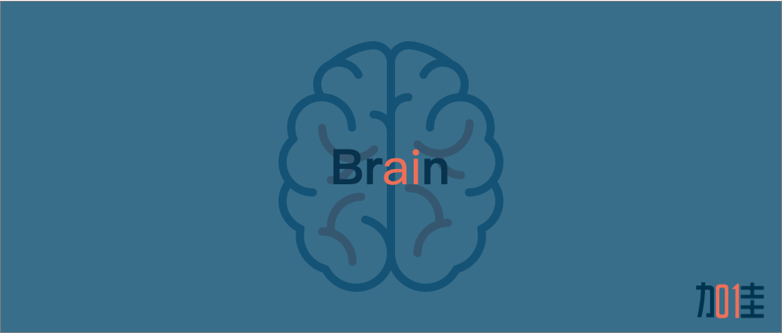

## About

加佳技术实验室（JJia Technology Lab ），技术领域涉及但不限于区块链、人工智能、物联网、前端等。

本项目旨在汇聚俊采星驰的智慧于此，请洒潘江，各倾陆海云尔！

## How to
1. fork this repo
2. 以文章标题创建文章文件夹
3. 对应目录下创建 readme.md
4. 编辑文章，相关资源归档到对应文章文件夹下
5. 提交pull request
6. code review by [netpi](https://github.com/netpi)
7. 文章会布到微信公众号/掘金/csdn/知乎

## Posts

* [「10分钟入门 k8s」](./十分钟入门k8s) - *[@刘大伟](https://github.com/liulang491)*
* [「一文读懂Spring AOP实现原理」](./Spring%20AOP实现原理) - *[@王韡](https://github.com/jimmywang1994)*

